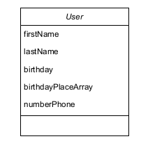

# mmm_tp3_android_firebase
      Quick Start
Pré-requis: Avoir une installation androidStudio son ordinateur ainsi qu'un emulateur android(Avd Manager sur Android Studio).
Les différentes étapes pour run le projet:

1- Le projet est récupérable sur un repository Github via la commande git clone <url http>.
url http: https://github.com/CecilebougmaIstic/mmm_tp3_android_firebase.git
2-

      Sujet:
L’objectif de ce TP est de prendre en main le BaaS (Backend As A Service) Firebase https://
firebase.google.com afin de stocker, d’accèder à, et synchroniser des données entre plusieurs terminaux
mobiles sous Android et un service web (cf Firebase Android: https://firebase.google.com/docs/
android/setup). Le TP repose sur les applications réalisées lors du TP1 et TP2 (dont la correction est
disponible).
Exercice 3.1 (Mise en place de Firebase et synchronisation)
1. Créez un projet Firebase (https://console.firebase.google.com et mettez en place les li-
   brairies nécessaires à l’utilisation de Firebase sous Android (https://firebase.google.com/
   docs/android/setup).

2. Modifiez votre application du TP2 de façon à permettre l’ajout d’un client non plus dans une BD
   locale via ROOM mais via un appel à l’API de Firebase. Pour cela crééez une nouvelle classe qui
   dérive de IRepository.
3. Enfin, l’ensemble de l’application de façon à ce qu’elle récupère la liste des clients via l’API Firebase
4. Vérifiez la bonne synchronisation de l’ensemble (création de clients, récupération de clients) entre
   plusieurs terminaux, eg via plusieurs émulateurs.

# # # # # # # # # # # # # # # # # # # # # # # # # # # # # # # # 

Exercice 3.1 (Mise en place de Firebase et synchronisation)
1. Créez un projet Firebase

Le projet sur le console Firebase se nomme: mmm-tp3-android-firebase   
url:https://console.firebase.gogle.com/project/mmm-tp3-android-firebase

2. Modifiez votre application du TP2 de façon à permettre l’ajout d’un client non plus dans une BD
   locale via ROOM mais via un appel à l’API de Firebase.
   #Stockage des données  dans Firestore 
Pour cette tâche, 2 packages ont été créés. Le package repository et le package manager.
Dans le package repository, dans la classe UserRepository, des méthodes CRUD ont été implémentées pour persister
les données dans la base de données Firestore.
La persistance des données dans la BD s'articule du model User (voir le diagramme de classe de la classe User ci-dessous).
NB: L'attribut numberPhone n'a pas été sauvé en base de données. 
   Il est caché par une la propriété gone.
Le model de la classe user:

   #RecyclerView
A partir de l'IHM du Fragment1, on peut accéder à une liste des utilisateurs à partir du bouton
nommé RECYCLERV. Cette IHM nommée ItemFragment est remplie par des données provenant de la base de données
() grâce à une méthode de type Query située dans la classe .....

   
